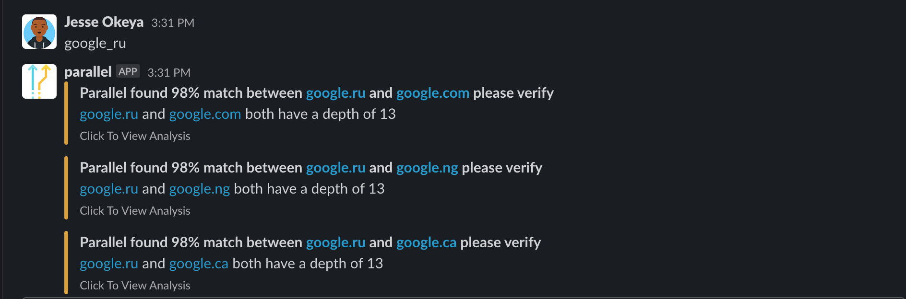
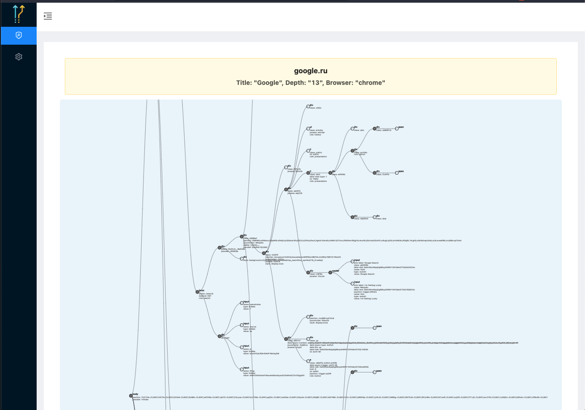
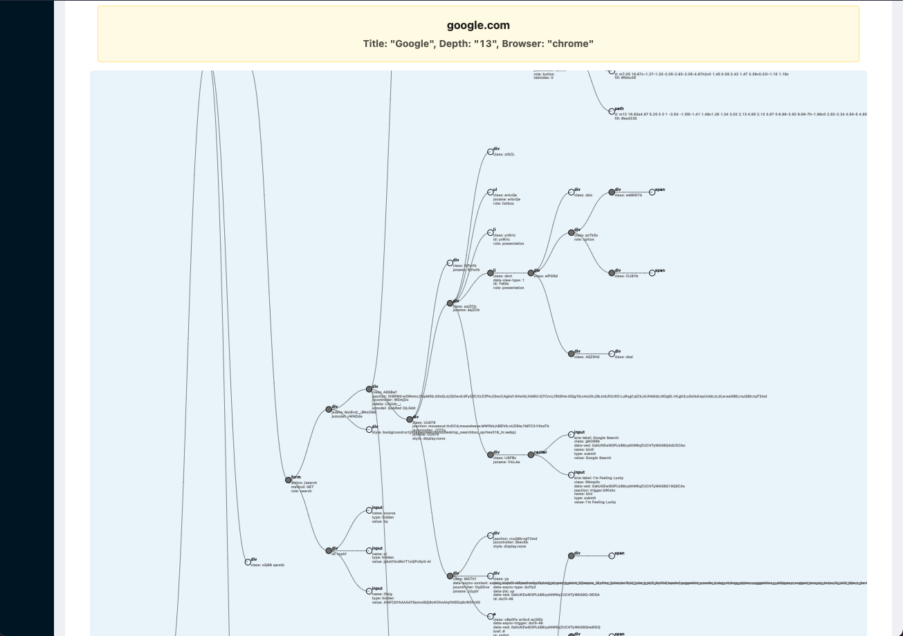
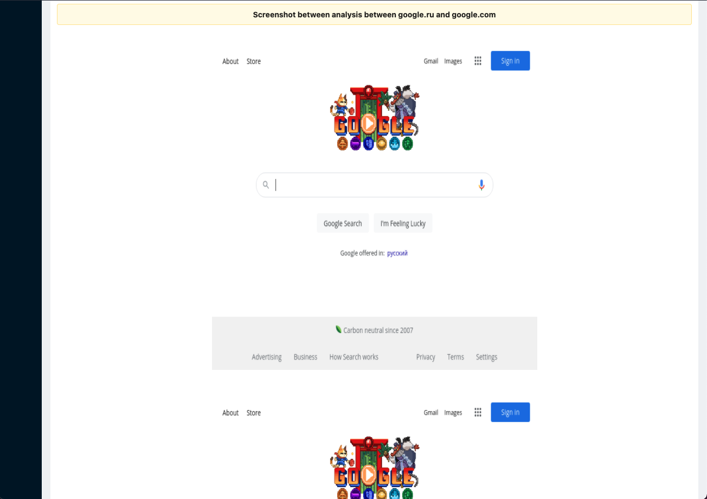

# parallel-server
Parallel server is runs snapshot comparison between multiple domains and returns percentage similarities across multiple domains.

Parallel is integrated directly to slack so whenever you type spaces separated domains replacing the dots with underscores. i.e `google.com` becomes `google_com`

You get a brief analysis of percentage similarity score between the current website and all previously cached websites in the database then if you click on view analysis you get a more detailed analysis

 

And for the other domain that matched

This images shows the dom (document object model) nodes and the tree structure of those nodes with their attributes

And finally a screenshot comparing the 2 sites / domain

#### This applications was built with:
* Express (web server framework)
* MongoDB (nosql database that stores dom snapshots of previously seen websites)
* Redis backed Queue utilizing bullmq (to process jobs for website comparisons asynchronously)
* React (for the client side)
* Heroku (hosting / deployment)
